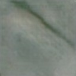

# GenAI‐marble_cracks Dataset

## Overview
We propose a generative Artificial Intelligence (AI) approach, reporting the first synthetic marble crack texture image dataset using four generative adversarial networks (GANs). Each of the final four sub-datasets includes images of different cracks on marble surfaces. Moreover, to verify the effectiveness and significance of this work, two deep learning segmentation models are used to assess the quality of the synthetic marble crack image datasets.

The proposed generation and evaluation pipeline is illustrated in Fig. 1. From a finite number of original marble crack images of the MCS-2 dataset [1], four different GAN architectures are applied to generate sets of large-scale marble crack samples, forming the synthetic image dataset known as GenAI‐marble_cracks dataset. 

Fig. 1. The proposed generation and evaluation pipeline. Real marble crack images are preprocessed and fed to four generative AI models to derive a set of four synthetic datasets, that are comparatively evaluated. Real and synthetic images were combined in three different training strategies to further evaluate their performance for marble crack segmentation. Details on the implementation can be found in Vrochidou et al.[2].

Furthermore, we use the generated synthetic datasets to test the best two performing combination models from our previous work [1]: Feature Pyramid Network (FPN) and U-Net, both with efficientnetb4 backbone. The original full-resolution images of the MCS-2 dataset is cropped in 440 image patches, referring to the real image dataset. Fig. 2 illustrates samples of real and generated marble crack images by using the four synthesis models after training for 200 epochs.

## Dataset Structure
The dataset consists of real and generated marble crack images, organized as follows:

### **Folder Structure**
|Real Samples|   | ||  |  |  |  |
|-------------|----------------|-------------|-------------|-------------|-------------|-------------|-------------|
| GAN |   |||  |  |  |  |
| WGAN |   |||  |  |  |  |
| WGAN-GP |   |||  |  |  |  |
| WGAN-div |   |||  |  |  |  |

Fig. 2. Real (row 1) and generated marble crack images by method (rows 2-5).

## Description of Folders
## Dataset Overview

<table>
  <tr>
    <th>Folder Name</th>
    <th>Subfolder Name</th>
    <th>Description</th>
  </tr>
  <tr>
    <td rowspan="6"><b>GenAI‐marble_cracks dataset</b></td>
    <td colspan="2"><b></b>Marble crack generation</td>
  </tr>
  <tr>
    <td>real images</td>
    <td>440 image patches from MCS-2 dataset</td>
  </tr>
  <tr>
    <td>gan</td>
    <td>148 generated crack images with annotation masks</td>
  </tr>
  <tr>
    <td>wgan</td>
    <td>148 generated crack images with annotation masks</td>
  </tr>
  <tr>
    <td>wgan_div</td>
    <td>94 generated crack images with annotation masks</td>
  </tr>
  <tr>
    <td>wgan_gp</td>
    <td>121 generated crack images with annotation masks</td>
  </tr>
  <tr>
    <td rowspan="6"><b>First experiment</b></td>
    <td colspan="2"><b></b>Marble crack segmentation</td>
  </tr>
  <tr>
    <td>Segmentation on real F(R), U(R)</td>
    <td>Segmentation results with FPN and UNET for 5 folds, 281 image patches from the real dataset + augmentation</td>
  </tr>
  <tr>
    <td>segm on gan F(R+G), U(R+G)</td>
    <td>Segmentation results with FPN and UNET for 5 folds, 281 real + augmentation + 100 generated by GAN</td>
  </tr>
  <tr>
    <td>segm on wgan F(R+WG), U(R+WG)</td>
    <td>Segmentation results with FPN and UNET for 5 folds, 281 real + augmentation + 100 generated by WGAN</td>
  </tr>
  <tr>
    <td>segm on wgan_div F(R+WG_div), U(R+WG_div)</td>
    <td>Segmentation results with FPN and UNET for 5 folds, 281 real + augmentation + 100 generated by WGAN-div</td>
  </tr>
  <tr>
    <td>segm on wgan_gp F(R+WG_GP), U(R+WG_GP)</td>
    <td>Segmentation results with FPN and UNET for 5 folds, 281 real + augmentation + 100 generated by WGAN-GP</td>
  </tr>
   <tr>
    <td rowspan="3"><b>Second experiment</b></td>
  </tr>
  <tr>
    <td><b>F(R+300 best)</b> F(R+300 best)</td>
    <td>Segmentation results with FPN for 5 folds and 281 image patches from the real dataset + augmentation + 300 synthetic images (100 from GAN, 100 from WGAN-GP, 100 from WGAN-div)</td>
  </tr>
  <tr>
    <td><b>U(R+ 200 best)</b> U(R+ 200 best)</td>
    <td>Segmentation results with UNET for 5 folds and 281 real + augmentation + 200 synthetic images (100 from GAN, 100 from WGAN-div)</td>
  </tr>
  <tr>
    <td rowspan="3"><b>Third experiment</b></td>
  </tr>
  <tr>
    <td><b>F(R+G extended)</b> F(R+G extended)</td>
    <td>Segmentation results with FPN for 5 folds and 281 image patches from the real dataset + augmentation + 200 generated by GAN</td>
  </tr>
  <tr>
    <td><b>U(R+ G extended)</b> U(R+ G extended)</td>
    <td>Segmentation results with UNET for 5 folds and 281 image patches from the real dataset + augmentation + 200 generated by GAN</td>
  </tr>
</table>

## Video Sequence Data

| **File Name**                  | **Description**                                                                 |
|--------------------------------|---------------------------------------------------------------------------------|
| `Crack_Generated_Images.mp4`  | Video sequence using OpenCV with ~50 images of the Marble crack image generation results |
| `Crack_Segmentation_Exp_1.mp4`| Video sequence using OpenCV with ~50 images of the Marble crack segmentation results of experiment 1 |
| `Crack_Segmentation_Exp_2.mp4`| Video sequence using OpenCV with ~50 images of the Marble crack segmentation results of experiment 2 |
| `Crack_Segmentation_Exp_3.mp4`| Video sequence using OpenCV with ~50 images of the Marble crack segmentation results of experiment 3 |

## References
1. E. Vrochidou et al., “Utilizing Generative AI for Crack Detection in the Marble Industry,” *Engineering Research Express*, Jan. 2025, doi: [10.1088/2631-8695/adaca7](https://doi.org/10.1088/2631-8695/adaca7).
2. E. Vrochidou et al., “RGB and Thermal Image Analysis for Marble Crack Detection with Deep Learning,” in *International Conference on Paradigms of Communication, Computing and Data Analytics (PCCDA 2023)*, 2023.

## Citation
If you use this dataset in your research, please cite:

E. Vrochidou et al., “Utilizing Generative AI for Crack Detection in the Marble Industry,” *Engineering Research Express*, Jan. 2025, doi: [10.1088/2631-8695/adaca7](https://doi.org/10.1088/2631-8695/adaca7).
